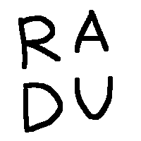
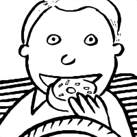

# Antialias with Deep Learning

Adds antialiasing (smooth edges) to an image containing black & white (1bit) drawings and text.

Here are some before/after examples (ideally viewed without browser scaling):

